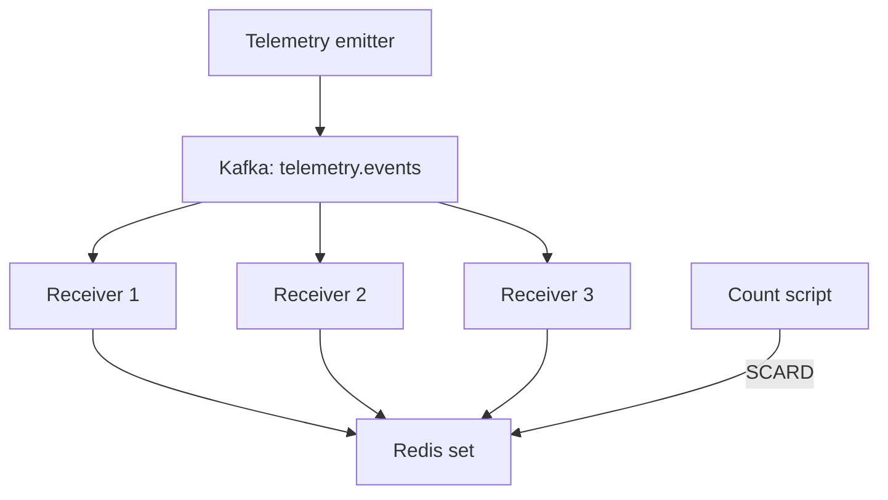

# Lumu Telemetry Tracker

A distributed Python application that consumes device telemetry from a partitioned Kafka topic, validates incoming events, and tracks the exact global number of unique IPv4 addresses in Redis.

This repository implements the timestamp parser and distributed unique-IP tracker requested in the Lumu backend challenge. It also includes a synthetic telemetry emitter, malformed-event simulation, unit tests, Docker Compose orchestration, and an independent command-line script for reading the current count.

## Implementation summary

The system separates event generation, transport, validation, storage, and observation into small components with clear responsibilities.

The emitter publishes synthetic device events across three Kafka partitions. Three receiver instances belong to the same consumer group, so Kafka distributes partition ownership and processing work among them. Each receiver validates the payload, normalizes its timestamp to UTC, validates the IPv4 address and error code, and atomically inserts the IP into a shared Redis set. Redis performs the global deduplication, while a standalone script reads the set cardinality without depending on a receiver API.

Invalid events are logged and skipped. Redis failures are allowed to propagate so that the current Kafka offset is not committed and the event can be replayed. Valid and intentionally malformed telemetry can be emitted to exercise both happy paths and defensive behavior.

## Architecture



- The emitter targets 1,000 events per second and distributes messages across three partitions.
- One local Kafka broker also acts as the KRaft controller; ZooKeeper is not required.
- Three receivers share the `telemetry-receptors` consumer group.
- Valid addresses are stored in the shared `telemetry:unique_ips` Redis set.
- The independent count script reads the set cardinality using `SCARD`.
- The short-lived `kafka-init` container creates the topic and exits successfully.

The target rate is not a throughput guarantee. Container scheduling, synchronous offset commits, logging, failures, and Kafka rebalances can affect the observed rate.

## Project layout

| Path | Purpose |
| --- | --- |
| `infra/docker-compose.yaml` | Kafka, Redis, emitter, receivers, and topic initialization |
| `redis/redis.conf` | Local Redis configuration |
| `telemetry-emitter/main.py` | Emission loop, rate control, reporting, and shutdown |
| `telemetry-emitter/telemetry.py` | Valid and malformed synthetic event generation |
| `telemetry-emitter/publisher.py` | Kafka publication and delivery callbacks |
| `telemetry-receptor/main.py` | Validation, storage orchestration, and event logging |
| `telemetry-receptor/utils.py` | Timestamp parsing and event validation |
| `telemetry-receptor/consumer.py` | Kafka polling and offset commits |
| `telemetry-receptor/redis_store.py` | Redis connection, registration, and count operations |
| `scripts/get_count.py` | Independent count and watch command |
| `test/unit/` | Unit tests and test dependencies |
| `makefile` | Build, runtime, test, and observation commands |

## Prerequisites

For the containerized application:

- Docker Engine with Docker Compose v2, or Docker Desktop using Linux containers.
- GNU Make.
- Internet access for the initial image and dependency downloads.
- Local ports `9092` and `6379` available.

For local scripts and unit tests:

- Python and pip. Use a Python version compatible with the application type annotations and dependencies.

Python and a local virtual environment are not required to run the emitter or receivers because their dependencies are installed inside their Docker images.

## Quick start

Open a terminal at the repository root, where the `makefile` is located, and start Docker.

### Build and run from scratch

The shortest build-and-start command is:

```bash
make build run
```

`build` validates the Compose configuration and builds the emitter and receiver images. `run` starts all services in the background. Docker downloads missing base and infrastructure images when required.

For an explicit initial setup that pulls the infrastructure images first:

```bash
make setup run
```

Check the resulting containers:

```bash
make status
```

Expect one emitter, one Kafka broker, one Redis server, and three active receivers. The additional `kafka-init` container should show `Exited (0)` because it is an initialization job rather than a long-running service.

### Inspect processing

```bash
make logs SERVICE=receptor TAIL=50
```

Accepted-event logs include the normalized timestamp, device IP, error code, whether the IP was new, and the global count observed at query time. Invalid events produce a warning and are skipped.

Press `Ctrl+C` to stop following logs. This does not stop the containers.

### Query the unique-IP count

```bash
make count
```

This installs or checks the local script dependency and executes `scripts/get_count.py`. Redis must be running, but receivers do not need to remain active for a read-only query.

To refresh the count continuously:

```bash
make count-watch
```

Watch mode polls Redis every 0.5 seconds under normal response times and replaces the current console line. Press `Ctrl+C` to exit.

### Run unit tests

```bash
make unit-tests
```

The target installs the dependencies in `test/unit/requirements.txt` and executes the complete unit-test directory with verbose output. The suite covers the 15 documented timestamp examples along with additional accepted values, invalid types, malformed formats, invalid calendar values, non-finite numbers, timezone normalization, and whitespace handling.

## Command reference

| Command | Behavior |
| --- | --- |
| `make` / `make help` | Display command help |
| `make validate` | Validate the Compose configuration |
| `make setup` | Validate, pull infrastructure images, and build application images |
| `make build` | Rebuild emitter and receiver images |
| `make run` | Start all services in the background |
| `make build run` | Build and start the complete application |
| `make restart-apps` | Restart emitter and receiver containers only |
| `make stop` | Stop services without removing their containers |
| `make status` | Display all container states |
| `make logs` | Follow logs from all services |
| `make logs SERVICE=receptor TAIL=50` | Follow selected service logs |
| `make install-scripts` | Install dependencies for the count script |
| `make count` | Query the unique-IP count once |
| `make count-watch` | Refresh the unique-IP count continuously |
| `make install-unit-tests` | Install unit-test dependencies |
| `make unit-tests` | Install dependencies and execute unit tests |

After modifying containerized Python code or its requirements, rebuild and recreate the affected containers:

```bash
make build run
```

`make restart-apps` restarts existing containers but does not rebuild images or include modified source files.

## Optional local virtual environment

Windows PowerShell:

```powershell
python -m venv .venv
make count PYTHON=.venv/Scripts/python.exe
make unit-tests PYTHON=.venv/Scripts/python.exe
```

Linux or macOS:

```bash
python3 -m venv .venv
make count PYTHON=.venv/bin/python
make unit-tests PYTHON=.venv/bin/python
```

The virtual environment does not need to be activated when `PYTHON` points directly to its interpreter. The override affects local commands only, not the Python runtime inside Docker.

## Event contract

```json
{
  "timestamp": "2021-12-03T16:15:30.235Z",
  "device_ip": "10.0.0.42",
  "error_code": 0
}
```

Receivers expect a UTF-8 JSON object containing:

- `timestamp`: a supported ISO-style date-time or numeric Unix timestamp.
- `device_ip`: a string containing a valid IPv4 address.
- `error_code`: a finite JSON number; booleans are rejected.

The timestamp parser returns a timezone-aware `datetime` normalized to UTC. It accepts ISO strings using `T` or a space, optional fractional seconds, `Z`, explicit numeric offsets, and timestamps without timezone information. A missing timezone is interpreted as UTC.

Numeric timestamps whose absolute value is at least `100_000_000_000` are interpreted as milliseconds; smaller values are interpreted as seconds. This heuristic covers the supplied challenge examples, although a production schema should provide an explicit timestamp unit to remove ambiguity.

Malformed JSON, invalid IPv4 addresses, unsupported timestamps, missing fields, and invalid error codes are logged and skipped. Their offsets are committed after the skip so that one malformed record does not block its partition indefinitely.

## Synthetic telemetry configuration

The local workload is controlled by the following settings:

| Setting | Current value | Purpose |
| --- | ---: | --- |
| `EVENTS_PER_SECOND` | `1000` | Target number of events published each second |
| `PARTITIONS` | `3` | Number of Kafka topic partitions used for distribution |
| `REPORT_INTERVAL_SECONDS` | `1` | Frequency of emitter progress reports |
| `DEVICE_COUNT` | `100000000` | Size of the simulated device-address pool |
| `INVALID_EVENT_RATE` | `0.20` | Probability that a generated event is intentionally malformed |

`EVENTS_PER_SECOND`, `PARTITIONS`, and `REPORT_INTERVAL_SECONDS` are configured in the emitter runtime module. `DEVICE_COUNT` controls the bounded address pool in `telemetry-emitter/telemetry.py`. `INVALID_EVENT_RATE` can be supplied through the emitter environment; its default is `0.20`.

For example, in `infra/docker-compose.yaml`:

```yaml
emitter:
  environment:
    INVALID_EVENT_RATE: "0.20"
```

Useful invalid-event rates are:

| Value | Behavior |
| ---: | --- |
| `0.00` | Generate only valid events |
| `0.20` | Generate approximately 20% invalid events |
| `0.50` | Generate approximately equal valid and invalid traffic |
| `1.00` | Generate only invalid events |

The invalid-event simulation includes malformed timestamps, invalid IPv4 values, invalid error codes, and missing required fields. These events are intentional and allow the complete rejection path to be observed in receiver logs.

After changing an emitter setting, run:

```bash
make build run
```

IP selection is random, so duplicate events are expected. Once every address in the configured pool has been observed, the unique count stops increasing even while Kafka continues receiving events.

Keep `DEVICE_COUNT` and `BASE_IP` within the IPv4 address space. Increasing `EVENTS_PER_SECOND` changes the target publication rate but does not guarantee that the host, broker, consumers, and Redis instance can sustain it.

## Runtime configuration

| Variable | Compose value / default | Purpose |
| --- | --- | --- |
| `KAFKA_BOOTSTRAP_SERVERS` | `kafka:19092` in Compose; `localhost:9092` locally | Kafka connection |
| `KAFKA_TOPIC` | `telemetry.events` | Input topic |
| `KAFKA_GROUP_ID` | `telemetry-receptors` | Shared receiver group |
| `REDIS_URL` | `redis://redis:6379/0` in receivers; `redis://localhost:6379/0` locally | Redis connection |
| `REDIS_IPS_KEY` | `telemetry:unique_ips` | Shared set key |
| `INVALID_EVENT_RATE` | `0.20` | Fraction of simulated malformed events |

All receivers and the count script must target the same Redis database and key. Inside a container, `localhost` refers to that container rather than the Kafka or Redis service.

## Exact unique-IP counting

For each valid event, the receiver:

1. Decodes and validates the payload.
2. Executes `SADD` against the shared Redis set.
3. Reads `SCARD` for the demonstration log.
4. Returns successfully from the handler.
5. Commits the Kafka offset.

`SADD` atomically inserts and deduplicates each IP. Its return value indicates whether the address was newly added. `SCARD` returns the total number of members in the set. Ten events containing the same valid IP therefore represent one unique device IP.

The insertion and count query are separate operations. A logged total may include IPs inserted concurrently by another receiver between those calls; it represents the global count at read time.

If a receiver crashes after insertion but before committing its Kafka offset, the event can be replayed without inflating the count because insertion into a set is idempotent. If Redis raises an error, the handler fails and the current offset is not committed. This provides replay-safe insertion with at-least-once processing, not an exactly-once transaction spanning Kafka and Redis.

## Assumptions and current limitations

- All receivers use the same Kafka consumer group.
- Timestamps without timezone information represent UTC.
- The seconds/milliseconds threshold is a documented heuristic based on the supplied examples.
- Invalid events are logged and skipped.
- Redis failures prevent the current event from being committed.
- Offsets are committed after handling.
- Redis persistence is disabled in the current local configuration.
- The local Kafka and Redis deployments are single-node development services without authentication or TLS.

Because Redis persistence is disabled and no durable application data volume is configured, the count means unique valid IPs observed while the current Redis state exists. Restarting Redis loses that set. Kafka may retain committed offsets independently, so restarting Redis does not automatically reconstruct the previous count.

## Scaling challenges and solutions

The local topology demonstrates the distributed behavior, but larger telemetry volumes introduce several operational challenges.

### Kafka parallelism and consumer lag

The maximum useful number of receivers in one consumer group is bounded by the partition count. Extra consumers remain idle. As traffic grows, I would monitor consumer lag and increase partitions and receiver capacity together. Partition increases also affect ordering and key distribution, so they should be planned rather than treated as a transparent runtime change.

### Offset commit throughput

Committing every event synchronously makes the processing boundary easy to reason about, but it adds network overhead. At higher volumes, I would process bounded batches and commit only the highest safely completed offset for each partition. Any concurrent implementation must avoid committing past unfinished records.

### Redis network traffic

The demonstration performs `SADD` and `SCARD` for every valid event. The count is not required for ingestion, so at scale I would remove `SCARD` from the hot path and query it only from the independent observation command. Redis pipelines or bounded batches could reduce round trips for insertions.

### Exact-set memory growth

An exact Redis set grows with the number of unique IPs. I would monitor memory and cardinality, define the required counting window, and use partitioned sets or a clustered Redis deployment when necessary. HyperLogLog could reduce memory substantially, but it would change the requirement from an exact count to an approximate one and is therefore not used here.

### Availability and recovery

The local Kafka broker and Redis server are single points of failure. A production deployment would require replicated Kafka brokers, durable Redis storage or a managed clustered service, authentication, encryption in transit, backups, health checks, and tested recovery procedures.

Kafka offsets and Redis state cannot be committed in one atomic transaction. The Redis set makes duplicate reprocessing safe, but state loss still requires a deliberate replay strategy. I would retain Kafka data long enough to rebuild Redis and coordinate any reset of consumer offsets with the Redis recovery boundary.

### Logging volume and malformed traffic

Per-event informational logs are useful for this challenge but become expensive and noisy at production scale. I would replace them with aggregated metrics, sampled logs, structured warnings, consumer-lag alerts, and malformed-event counters. If investigation or later reprocessing is required, invalid records can be published to a dedicated dead-letter topic instead of only being skipped.

### Load generation and validation

The configured event rate is a target rather than proof of capacity. Before increasing production traffic, I would run repeatable load tests that measure producer throughput, partition balance, consumer lag, Redis latency, memory growth, failure recovery, and the effect of malformed-event bursts.

## Troubleshooting

| Symptom | Check |
| --- | --- |
| `make` is not recognized | Install GNU Make and ensure it is available on `PATH` |
| Docker connection failure | Start Docker and confirm Linux containers are enabled |
| `kafka-init` shows `Exited (0)` | Expected: topic initialization completed successfully |
| Counter cannot connect to Redis | Check Redis state, port `6379`, and `REDIS_URL` |
| Unique count stops increasing | Check `DEVICE_COUNT`; a bounded random pool eventually saturates |
| Container uses old code | Run `make build run` |
| Unit tests cannot import `utils` | Check `test/unit/telemetry-receptor/conftest.py` |
| Unit tests fail on `str | int` | Use Python 3.10+ or a Python 3.9-compatible annotation |
| Receiver remains idle | Check topic creation, partition assignment, consumer group, and broker address |

## License

This project is licensed under the MIT License. See [`LICENSE`](LICENSE) for the complete license text.
