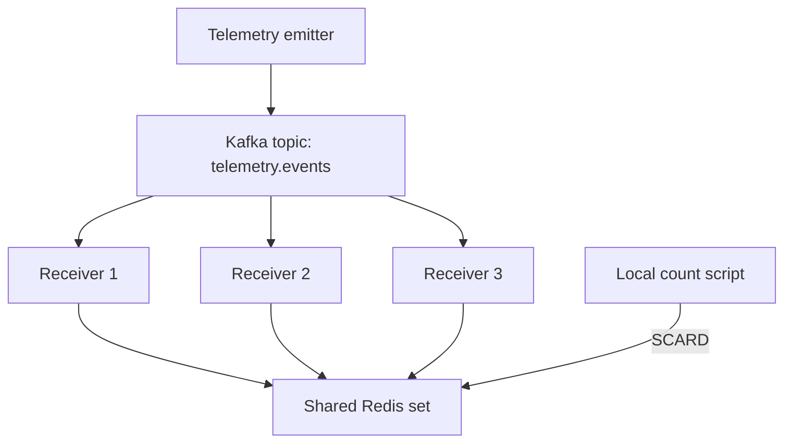

# Lumu Telemetry Tracker

A small distributed Python application that consumes device telemetry from Kafka, validates timestamps and IPv4 addresses, and tracks the exact global number of unique device IPs in Redis.

The project implements the timestamp parser and distributed unique-IP tracker described in the Lumu backend challenge. A separate telemetry emitter provides a local demonstration workload. A standalone command-line script queries Redis without calling or depending on the receiver application.

## Motivation

The goal is to make the distributed counting behavior easy to understand, run, and verify. Multiple workers may encounter the same device IP, so summing local counters would overcount devices. A shared Redis set provides one deduplicated view across all workers.

The implementation deliberately separates event generation, transport, validation, storage, and orchestration. It uses a CLI rather than an HTTP API because the challenge explicitly allows querying the data store with a script. No web framework is needed for that requirement.

## Architecture



- One emitter targets 300 events per second and explicitly distributes events round-robin across three partitions.
- One local Kafka broker also acts as the KRaft controller; no ZooKeeper service is needed.
- Three receiver instances share the `telemetry-receptors` consumer group. Kafka assigns partitions to group members; this is work sharing, not broadcasting.
- All receivers add valid IPs to the same Redis set, `telemetry:unique_ips`.
- The local counter reads that set's cardinality. It does not run inside a receiver or require a separate Compose service.
- A short-lived `kafka-init` container creates the topic and exits successfully.

With three healthy receivers and one assigned partition each, the intended input distribution is approximately 100 events per second per receiver. This is not a measured throughput guarantee: scheduling, synchronous commits, logging, failures, and rebalances affect processing speed.

## Project layout

| Path | Purpose |
| --- | --- |
| `infra/docker-compose.yaml` | Kafka, Redis, emitter, three receivers, and topic initialization |
| `redis/redis.conf` | Local Redis server configuration |
| `telemetry-emitter/main.py` | Emission loop, target rate, logging, and shutdown |
| `telemetry-emitter/telemetry.py` | Synthetic event generation |
| `telemetry-emitter/publisher.py` | Kafka publication, round-robin routing, delivery callbacks |
| `telemetry-emitter/Dockerfile` | Emitter image |
| `telemetry-emitter/requirements.txt` | Emitter dependencies |
| `telemetry-receptor/main.py` | Validation/storage orchestration and event logs |
| `telemetry-receptor/utils.py` | Timestamp parsing and event validation |
| `telemetry-receptor/consumer.py` | Kafka polling and offset commits |
| `telemetry-receptor/redis_store.py` | Redis connection, IP registration, and count retrieval |
| `telemetry-receptor/Dockerfile` | Shared image for all receiver instances |
| `telemetry-receptor/requirements.txt` | Receiver dependencies |
| `scripts/get_count.py` | Independent local count and watch command |
| `scripts/requirements.txt` | Local counter dependency |
| `makefile` | Build, runtime, and observation commands |

## Prerequisites

For the containerized application:

- Docker Engine with Docker Compose v2, or Docker Desktop configured for Linux containers.
- GNU Make available in your terminal.
- Internet access for the first image download and dependency installation.
- Available local ports 9092 and 6379.

For the independent counter only:

- Local Python with pip; Python 3.12 is a convenient match for the container runtime.
- The packages in `scripts/requirements.txt`.

Python, pyenv, and a local virtual environment are not required to run the emitter or receivers in Docker. Their Dockerfiles install dependencies during image construction. All three receivers start from the same receiver image.

## Quick start

Obtain the repository and open a terminal at its root, where the `makefile` lives. Start Docker before running these commands.

### 1. Build and start

```bash
make setup
make run
make status
```

`setup` validates Compose, pulls the Kafka and Redis images, and builds the Python images. `run` starts the application in the background.

Equivalent combined invocation:

```bash
make setup run
```

Expect six active containers: one emitter, one Kafka broker, one Redis server, and three receivers. The additional `kafka-init` container should show `Exited (0)`; it is an initialization job, not a long-running service.

### 2. Inspect processing

```bash
make logs SERVICE=receptor TAIL=20
```

Accepted events include a normalized timestamp, device IP, error code, whether the IP was new, and the global count observed at query time. Invalid events produce a brief warning and are skipped.

Press Ctrl+C to stop following logs. This does not stop the containers.

### 3. Query the count

```bash
make count
```

This installs the local script dependencies if necessary and runs `scripts/get_count.py` with your local Python. Redis must be running, but the receivers do not need to remain active for a read-only query.

### 4. Watch the count

```bash
make count-watch
```

Watch mode polls every 0.5 seconds under normal response times and replaces the same console line. Press Ctrl+C to exit. Keep the terminal wide enough to avoid line wrapping. ANSI colors depend on terminal support and are disabled when `NO_COLOR` is set.

This is polling, not push-based real-time delivery. A slow Redis request can delay the next refresh.

### Optional: isolate the local script dependencies

In Windows PowerShell:

```powershell
python -m venv .venv
make count PYTHON=.venv/Scripts/python.exe
make count-watch PYTHON=.venv/Scripts/python.exe
```

On Linux or macOS:

```bash
python3 -m venv .venv
make count PYTHON=.venv/bin/python
make count-watch PYTHON=.venv/bin/python
```

These commands do not require activating the virtual environment. Keep `.venv/` out of version control. The `PYTHON` override only affects local commands, not the Python version inside Docker.

## Command reference

| Command | Behavior |
| --- | --- |
| `make` / `make help` | Display command help |
| `make validate` | Validate Compose syntax and configuration |
| `make setup` | Validate, pull infrastructure images, and build application images |
| `make build` | Rebuild emitter and receiver images using available build cache |
| `make run` | Start services and apply changed images/configuration |
| `make restart-apps` | Restart emitter and receiver containers only |
| `make stop` | Stop all services without removing containers |
| `make status` | Show all container states, including the initialization job |
| `make logs` | Follow logs from all services |
| `make logs SERVICE=emitter TAIL=50` | Follow selected service logs |
| `make install-scripts` | Install dependencies for the local counter |
| `make count` | Install/check script dependencies and query once |
| `make count-watch` | Install/check script dependencies and poll every 0.5 seconds |

After modifying containerized Python code or requirements:

```bash
make build
make run
```

`restart-apps` does not rebuild images or incorporate modified source files. Local changes to `scripts/get_count.py` need no Docker rebuild.

The installation prerequisite invokes pip on each counter launch. Already satisfied dependencies are not normally reinstalled, but pip output will appear before the counter.

## Event contract and validation

```json
{
  "timestamp": "2021-12-03T16:15:30.235Z",
  "device_ip": "10.0.0.42",
  "error_code": 0
}
```

Receivers expect a UTF-8 JSON object with all three fields:

- `timestamp`: a supported date-time string or numeric Unix timestamp. The parser returns a timezone-aware standard-library `datetime` normalized to UTC.
- `device_ip`: a string accepted as an IPv4 address. IPv6 is outside the current contract.
- `error_code`: a finite JSON number; booleans are rejected. No business meaning or filtering is assigned to individual codes.

The timestamp parser supports ISO-style strings with `T` or a space, optional fractional seconds, UTC `Z`, explicit numeric offsets, and strings without a timezone. A missing timezone is interpreted as UTC. Numeric strings containing integers are also accepted.

The seconds/milliseconds heuristic treats absolute numeric values at least `100_000_000_000` as milliseconds and smaller values as seconds. It covers the challenge's supplied examples, but is not a universal way to infer units: sufficiently early millisecond timestamps and far-future second timestamps are ambiguous. A production event schema should specify the unit explicitly.

Invalid JSON, malformed IPv4 addresses, invalid timestamps, missing fields, and invalid error codes are logged and skipped. Their offsets are committed after the skip, preventing a malformed event from blocking its partition indefinitely.

## Exact unique-IP counting

For each valid event:

1. Decode and validate the event.
2. Execute `SADD` against the shared Redis set.
3. Read `SCARD` for the current demonstration log.
4. Return successfully from the handler.
5. Commit the Kafka offset.

`SADD` performs insertion and deduplication atomically. No separate existence check or manually incremented counter is needed. Its result identifies whether the current IP was newly inserted. `SCARD` returns the number of members in the set.

Repeated events are allowed. Ten valid events with the same IP represent one unique IP, not ten. Deduplication is by IP, not by complete event identity.

The insertion and count query are separate operations. A displayed count may include IPs added by another receiver between them; it is the global count at the time of the read, not a transaction-specific total.

If a receiver crashes after insertion but before offset commit, replaying the event does not inflate the count while Redis retains the set. If Redis raises an error, the current handler fails and its Kafka offset is not committed. The current implementation exits on that failure rather than providing a managed recovery loop.

This is replay-safe insertion with at-least-once processing behavior, not an end-to-end exactly-once transaction spanning Kafka and Redis.

## Synthetic telemetry

The emitter chooses device IPs from a bounded pool configured by `DEVICE_COUNT` in its generation module. The initial pool was 1,000 devices; it can be increased, for example, to 100,000. IP selection is random, so duplicates are intentional and reaching every possible device is not guaranteed within a fixed time.

Once the entire pool has been observed, the unique count stops increasing even though events continue arriving. This is expected behavior, not evidence that consumption stopped. Keep the configured IP range within IPv4 bounds.

The emitter currently generates valid events and several timestamp representations. Invalid-event injection and deterministic fixtures are follow-up work. The 300 events/second setting is an emission target; timing overhead can lower the actual rate.

## Configuration

| Variable | Container value / default | Purpose |
| --- | --- | --- |
| `KAFKA_BOOTSTRAP_SERVERS` | `kafka:19092` in Compose; `localhost:9092` for local Python | Kafka connection |
| `KAFKA_TOPIC` | `telemetry.events` | Input topic |
| `KAFKA_GROUP_ID` | `telemetry-receptors` | Shared receiver group |
| `REDIS_URL` | `redis://redis:6379/0` in receivers; `redis://localhost:6379/0` for the local script | Redis connection |
| `REDIS_IPS_KEY` | `telemetry:unique_ips` | Shared set key |

All receivers and the count script must use the same Redis database and key. Within a container, `localhost` refers to that container, not the Redis or Kafka service.

Compose supplies the application environment variables. Setting a variable in your host shell does not override a hard-coded Compose value automatically. Edit Compose when changing container configuration; local script environment variables can be set directly in your shell.

## Persistence and lifecycle: important limitation

The local Redis configuration disables snapshots and append-only persistence. The Compose configuration does not define durable application data volumes.

The count currently means unique valid IPs successfully recorded since the shared Redis set was last empty. This corresponds to a fresh service run only when the shared state and Kafka consumption boundary are initialized consistently. There is no coordinated run identifier or reset mechanism yet.

- Restarting an individual receiver preserves Redis state and normally resumes from committed Kafka offsets.
- Restarting or stopping Redis loses the set under the current configuration.
- Kafka can retain committed offsets in its existing container while Redis loses the count. Restarting both does not automatically replay previously committed events.
- `auto.offset.reset=earliest` applies when no usable committed offset exists; it does not override existing commits on every startup.
- `make setup run` is a build/start workflow, not a data reset.

Do not treat the present setup as durable across infrastructure restarts. Before relying on restart recovery, choose and implement either durable shared state with an appropriate replay strategy, or an explicit fresh-run lifecycle that coordinates Redis state and Kafka offsets. Persistence alone is not a cross-system atomicity guarantee.

## Why these choices?

| Choice | Rationale and trade-off |
| --- | --- |
| Python | Keeps parsing and validation in the standard library and makes behavior easy to inspect |
| Kafka client library | Avoids implementing the Kafka protocol; transport-specific dependency is justified |
| Redis set | Exact, shared, atomic deduplication; memory grows with unique IP count |
| Three identical receivers | Demonstrates multi-instance processing without separate code paths per node |
| CLI instead of REST | Meets the challenge's retrieval option without introducing an HTTP server |
| Docker Compose | Makes a local multi-process demo reproducible; not a production HA deployment |
| Separate modules | Keeps business validation independent from Kafka and Redis connection details |
| Explicit round-robin | Matches the input distribution described by the challenge and exposes cross-partition duplicates |
| Manual commits after handling | Makes the successful-processing boundary explicit; per-event synchronous commits cost throughput |

The only third-party Python packages directly required are `confluent-kafka` and `redis`, according to each component's requirements file. Parsing, logging, argument handling, timing, and IP validation use the standard library.

## Verification status and next steps

The local demonstration has returned a count from the independent script and displayed counts above the original 1,000-device pool after expansion. This confirms a working demonstration path, not exhaustive correctness, balanced receiver throughput, or failure-recovery guarantees.

Before final delivery:

- Add automated tests for all 15 timestamp examples, invalid formats, timezone conversion, precision, and numeric boundaries.
- Add validation tests for malformed JSON, invalid UTF-8, IPv4 errors, missing fields, and non-finite numbers.
- Use a finite deterministic event fixture with a known expected unique count, including repeated IPs across partitions.
- Verify all three receivers actually receive partition assignments and inspect consumer lag.
- Test receiver interruption between Redis insertion and Kafka offset commit.
- Resolve and document the Redis/Kafka lifecycle issue described above.

## Scaling considerations

- More receivers improve parallelism only up to the number of assigned partitions. Additional idle consumers do not increase processing capacity.
- Per-event synchronous commits, full event logs, and two Redis calls per valid event are demonstration-oriented. Batch safe offsets, reduce log volume, and move count reads to the independent CLI when optimizing throughput.
- Exact Redis sets consume memory proportional to the number of unique IPs. Monitor cardinality and memory; avoid eviction or expiry that would silently change lifetime-count semantics.
- Approximate structures such as HyperLogLog would change the exactness guarantee and are not used here.
- A single Redis server and Kafka broker are availability bottlenecks. Production requires an explicit replication, recovery, security, and capacity strategy.
- Batching or concurrency must preserve the rule that committed offsets never advance past unfinished records in a partition.

## Troubleshooting

| Symptom | Check |
| --- | --- |
| `make` is not recognized | Install GNU Make and ensure it is on PATH, or use the underlying Docker/Python commands |
| Docker connection failure | Start Docker and confirm Linux containers are available |
| `kafka-init` shows `Exited (0)` | Expected: topic initialization completed |
| Counter cannot connect to Redis | Check Redis state, port 6379, and the local `REDIS_URL` |
| Counter stays at 1,000 | Check the emitter's `DEVICE_COUNT`; the original pool is capped at 1,000 |
| Count is zero unexpectedly | Check the Redis key/database and whether Redis restarted |
| Container uses old code | Run `make build`, then `make run` |
| Receiver cannot import `utils` | Ensure its Dockerfile copies `utils.py` |
| Receiver cannot import `redis` | Ensure receiver requirements include Redis, then rebuild |
| Watch output wraps | Widen the terminal; the current display updates a single line |

Kafka and Redis use plaintext local development connections. Published ports are bound to loopback, but there is no authentication/TLS configuration for application traffic. Do not expose this configuration to an untrusted network.

## License

See `LICENSE` for the repository's license terms.